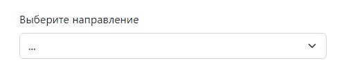
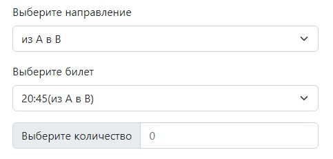
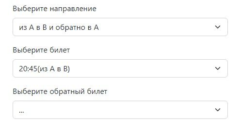
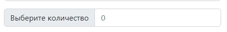
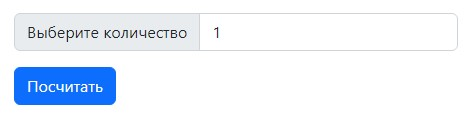
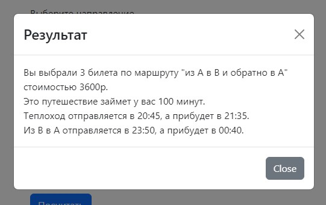

<h1 align="center">Время из A в B</h1>

### Дефолтное состояние формы, когда ничего не выбрано

### Cостояние формы, когда выбран билет "из А в В" или "из В в А"

### Cостояние формы, когда выбран билет "из А в В и обратно в А"

### После того, как все поля заполнены, то отображается выбор количества билетов

### Если выбранное количество билетов > 1, то отображается кнопка "Посчитать"

### По клику на кнопку "Посчитать", отображается модальное окно с итоговыми значениями

